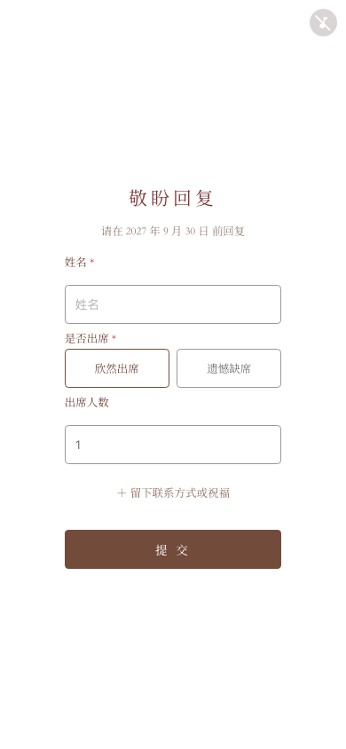
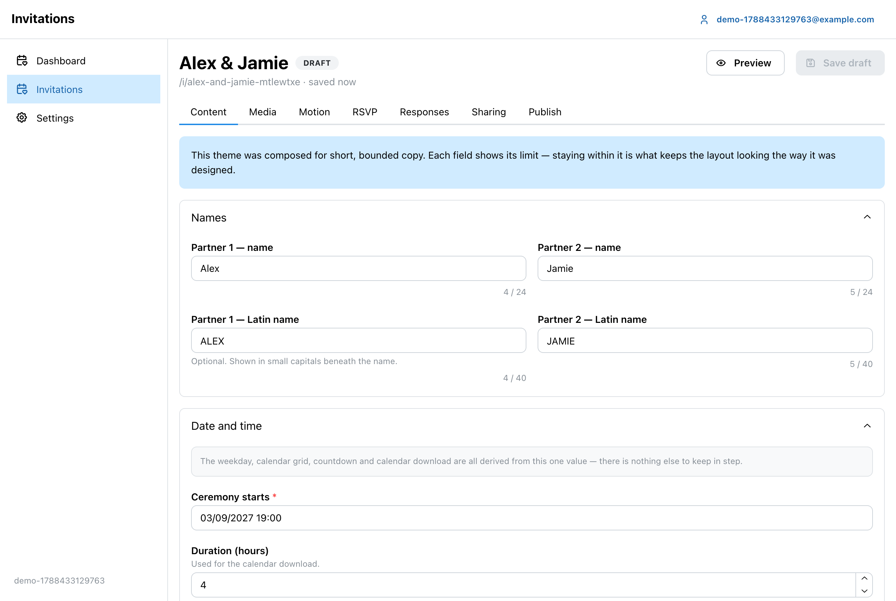
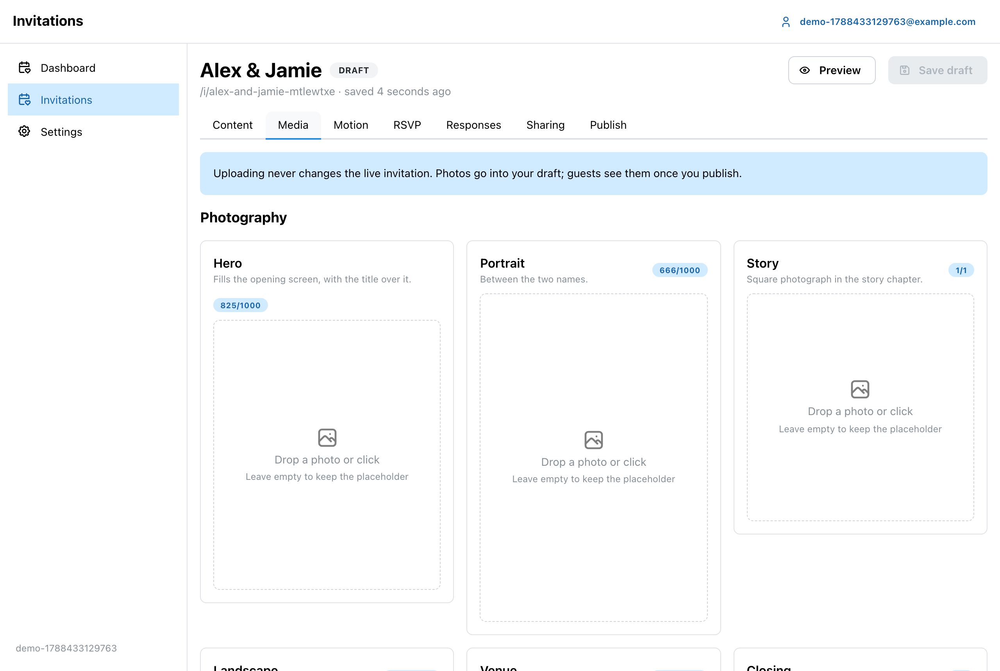
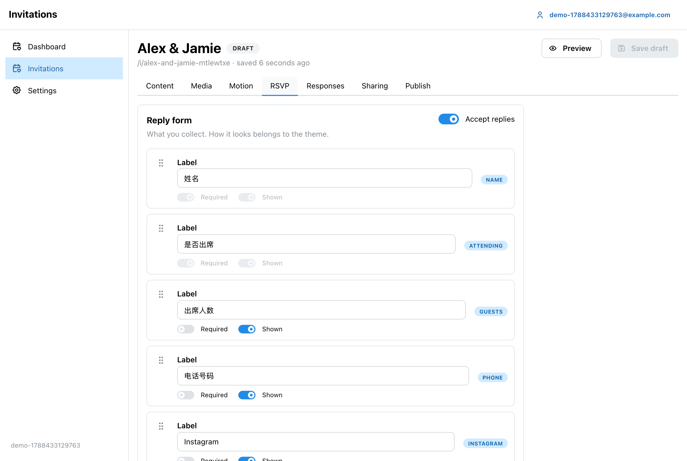

# Invitation platform

A cinematic wedding-invitation platform that runs entirely on Cloudflare:
one Worker, one D1 database, one R2 bucket.

Guests get a slow vertical film — full-bleed photography, a flip countdown
and an RSVP form the canvas parks itself on. Couples get an admin console
to write it. Operators get an inventory and a manual cleanup tool.

<p align="center">
  
  
  
</p>

The invitation never scrolls. A fixed one-screen viewport clips a long
canvas that drifts upward at a fixed reading pace, can be dragged, and
stops when it reaches the reply form.

**Live demo:** [wedding-invite-test.johnlee-my.workers.dev/i/demo](https://wedding-invite-test.johnlee-my.workers.dev/i/demo)

> A published invitation with fictional content, running on the hosted
> deployment. Replies are disabled on the demo.
>
> This is a demonstration, not a service with an availability guarantee.
> **Hosted signup is not open** — there is no public SaaS to register for
> yet. To use this today, self-host it: that path is fully supported,
> documented, and needs nothing from anyone else's infrastructure.

---

## The admin

<p align="center">
  
</p>

Content editing is driven by the theme manifest, so every field shows the
limit the server actually enforces. The composition was designed for
bounded text, and the platform keeps it that way rather than reflowing
the design around an arbitrarily long string.

<p align="center">
  
  
</p>

Media slots preview at the real aspect ratio the invitation uses, and the
focal-point control picks the `object-position` the theme will apply —
the original bytes are never re-encoded.

---

## What it does

- **Multiple invitations per workspace**, each with its own public link
- **Draft → preview → publish**, where publishing is an atomic pointer
  flip onto an immutable revision, so a guest never sees half an edit
- **Preview links** you can send to a partner — no account needed, scoped
  to only the media that draft references
- **Media** in R2 under immutable keys: replacing a photo mints a new
  object, so a published invitation keeps the exact bytes it shipped
- **Configurable RSVP** with custom questions, validated against the
  schema that was published rather than the one being edited
- **CSV export** with spreadsheet-formula neutralisation
- **Operator console** for users, workspaces, storage and manual cleanup

Nothing expires. No cron deletes anything. Invitations persist until
someone deliberately removes them.

---

## Self-host quickstart

```sh
git clone <your-fork>
cd wedding-invite
npm install

cp wrangler.jsonc.example wrangler.jsonc   # fill in your account/database IDs
npx wrangler d1 create invite-platform
npx wrangler r2 bucket create invite-media

npx wrangler d1 migrations apply invite-platform --remote
npm run build
npx wrangler deploy
```

Open `/admin` on your deployed URL and create the first account — it
becomes the administrator, and registration closes behind it.

Full walkthrough, including local development against a local D1 and R2:
**[SELFHOST.md](SELFHOST.md)**.

---

## Stack

| Layer | Choice |
|---|---|
| Runtime | Cloudflare Workers (workerd) |
| Router | Hono |
| Database | D1 (SQLite) |
| Object storage | R2 |
| Public invitation | Plain ES modules, **no dependencies** |
| Admin consoles | React, Vite, Mantine, TanStack Query, React Router |
| Email | Cloudflare Email Service or Resend — optional |
| Tests | Vitest (Workers pool) + Playwright |

The guest-facing invitation ships zero runtime dependencies, and a test
asserts that no admin framework code can reach it. It is opened once, on
a phone, often on a poor connection — a framework would cost real
milliseconds to render a fixed composition.

Authentication is scrypt password hashing with opaque server-side
sessions in `__Host-` cookies. See **[SECURITY.md](SECURITY.md)**.

Password reset and email verification need a mail provider. Without one
the platform still runs — self-hosted mode does not require verification —
you simply cannot offer self-service password recovery. The public demo
above runs without email configured.

---

## Development

```sh
npm install
npx wrangler d1 migrations apply invite --local
npm run build
npm run dev
```

| Command | What it does |
|---|---|
| `npm run build` | Builds both admin consoles into `public/` |
| `npm test` | Worker/API suite against real D1 and R2 |
| `npm run typecheck` | Typechecks the Worker and both consoles |
| `npm run test:e2e` | Public invitation suite, incl. visual baselines |
| `npm run test:admin` | Admin + operator browser suite |
| `npm run deploy` | Builds, then deploys |

### The public invitation is frozen

`public/themes/cinematic-classic/` reproduces an accepted design, guarded
by screenshot baselines at 375/390/430 plus desktop. Changes there are
expected to be adapter seams, not redesigns. If you want different
visuals, add a theme — see **[THEMES.md](THEMES.md)**.

---

## Documentation

| | |
|---|---|
| **[SELFHOST.md](SELFHOST.md)** | Deploy it on your own account |
| **[CONFIGURATION.md](CONFIGURATION.md)** | Modes, bindings, quotas, email |
| **[THEMES.md](THEMES.md)** | Theme contract and adding Theme #2 |
| **[SECURITY.md](SECURITY.md)** | Auth, isolation, reporting a vulnerability |
| **[CONTRIBUTING.md](CONTRIBUTING.md)** | Setup, tests, expectations |

---

## Licence

[Apache License 2.0](LICENSE).

Chosen over MIT for its explicit patent grant and trademark clause, and
over AGPL because hosting is not the moat here — wider adoption and
community themes matter more than compelling hosted forks to publish
their changes.
